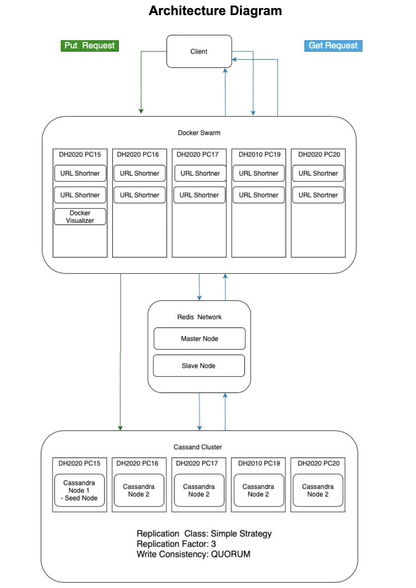
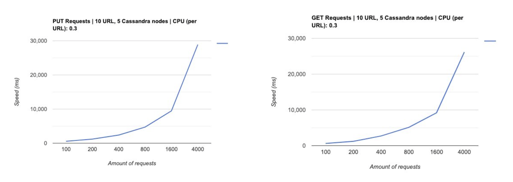
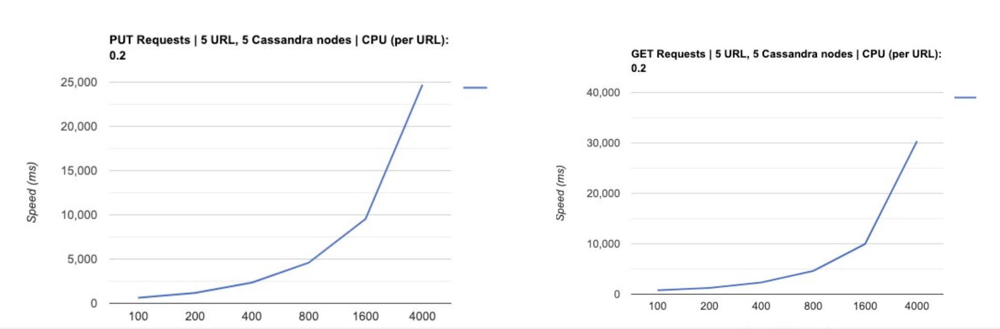

# Horizontally Scaling Distributed Database
Maps a string called short to a string called long where long can be a link to a website with a Horizontally Scaling Distributed Database.

** Built by: Aashdeep Brar, Abdulwasay Mehar and Vaishvik Maisuria** 

**Nov 10, 2020** 

**Architecture Diagram** 

The diagram above is an example of our system with 5 cassandra nodes, 10 URL shorteners and 1 redis slave node. The amount of containers running can be modified easily within the docker-compose.  

**Architecture and Analysis** 

The base architecture consists of three separate parts, Cassandra-Cluster, Redis-Network and Docker-Swarm. The list below describes the purpose of each section and the part it plays in the overall architecture: 

**Docker Swarm** 

As seen in the diagram above, docker swarm is being used to cluster all the available pcs together, which allows us to re-distribute all of the running services across all pcs. The component plays an important role in the architecture, as it is responsible for managing all of the URL-Shortener servers, and because we are using Docker Swarm, dockers load-balancing protocol kicks in to give each of the running Url Shorteners an equal load. 

Gunicorn was used to wrap up the flask based url-shortener. This is important because flask is a simple framework which is not suitable for production, whereas gunicorn provides a web-server functionality. 

**Redis Network** 

The redis network is also part of the docker swarm, but has been separated to display the overall flow of get requests. The purpose of Redis is to serve as a cache storage in memory, which will allow the network to handle frequent get-requests efficiently. Before searching within the cassandra cluster, url-shortener will check if the long of the required short exists in redis. 

The redis network consists of a master-slave architecture, which will allow the caching mechanism to still function if the machine running the master node goes down. The current setup has one slave but there is functionality to add multiple. The master node is able to read and write while the slaves are read-only nodes.  

**Cassandra Cluster** 

The Cassandra-Cluster is an important component of the architecture, as it serves as the base database to hold all the short and long pairs. The cassandra cluster follows the replication class ‘simpleStrategy’ which allows the architecture to specify the number of replications for each data row. Therefore, the architecture has a higher level of consistency as it will be able to tolerate (replication-factor - 1) node failures. 

The cluster is not part of the swarm due to the restriction of adding only a single node to the cluster at any given time, and since swarm doesn’t wait on nodes to be connected, starting up cassandra within the same docker file was not possible. The issue was also addressed by the TAs and Arnold, to which they allowed us to use a separate startup script for cassandra. 

**All Services:** 

All of the programs within each part of the architecture is being executed in a separate docker container. Because each program is a docker-container, it allows the architecture to recover from a program failure as each program is executed with a restart flag on failure. 

**Architecture Flow** 

**Put Requests** 

Upon receiving a put request, using the round-robin strategy docker swarm forwards the request to one of the connected URL-Shortener servers. To reduce the response time on the client side, URL servers utilizes the batch put technique to instantly respond back to the client, while still maintaining the validity of the put request. 

The url-servers store all the incoming put requests in memory, and at an interval of 1 seconds, a separate thread is created to send all the stored put requests into the cassandra cluster. The write request to the cassandra-cluster is written with the consistency level of QUORUM, which allows us to ensure that a majority of nodes responsible for the given data have successfully written the data, therefore maintaining a level consistency and higher failure tolerance. 

**Get Request** 

Since there will be more get requests than put requests, we make use of the redis caching mechanism to reduce the number of calls made to the Cassandra-Cluster. Upon receiving a get request, the required short is first searched within redis if it is not available there then a call to cassandra is initiated. If cassandra responds back with a valid response, the result of the get request gets stored into redis. 

**Architecture Scaling** 

Each section of the architecture can be scaled up easily if given additional hardware resources. To add more URL Servers, we can simply modify the number of replicas and the dedicated cpu in our docker-compose file and simply perform a system wide restart. Since we are using swarm, a rebalancing procedure can be performed to divide up the load equally amongst all pcs. 

Upon giving more memory, additional redis nodes can be added and existing nodes can be upgraded to have a higher memory limit. For redis, to add a new node, we can simply modify the number of replicas in the docker-compose file. With more memory we can also easily add more cassandra nodes. For Cassandra the make file can be used to connect more nodes.  

**Running The System** 

In order to simplify the process of running the system, we have set up a Makefile with a list of commands that you can run. This includes commands such as building the service, running it both locally and in a swarm, and configuring cassandra nodes.  

Along with this, we have a config file set up that stores the locations of the redis and cassandra nodes. If we were to scale up or scale down either of the services, we would need to make the changes within the config file as well. Once the changes are made, we would need to restart the web containers for the changes to be picked up. 

**Testing The System** 

In order to stress test the system, we made a python script to conduct tests with increasing load size. For each configuration, we tested the following number of requests for both put and get with 4 input threads: 

- 100 requests 
- 200 requests 
- 400 requests 
- 800 requests 
- 1600 requests 
- 4000 requests 

**Test 1:** 

**Test 2:** 

From the above 2 tests we can see that the overall  performance of put increases as we provide the architecture with less nodes but with higher dedicated cpu. This makes sense since the system is doing a batch put to the cassandra-cluster. 

However if we look at test 1, we can see that if we provide the architecture with more url shorteners, we will get better performance for get requests. This also makes sense, since the more url shorteners there are, the less load is distributed per each url-shortener.** 

**Raw Data** PUT Requests 

||**5 URL - 3 Cassandra** |**10 URL - 3 Cassandra** |
| :- | - | - |
|**100 Requests** |616.33 ms  |560 ms |
|**200 Requests** |1161.33 ms |1149 ms  |
|**400 Requests** |2338.67 ms |2483 ms  |
|**800 Requests** |4585.67 ms |4819 ms  |
|**1600 Requests** |9550.67 ms |9681 ms  |
|**4000 Requests** |24696.33 ms |23867 ms |
GET Requests 

||**5 URL - 3 Cassandra** |**10 URL - 3 Cassandra** |
| :- | - | - |
|**100 Requests** |808 ms |577 ms  |
|**200 Requests** |1243.33 ms |1107 ms |
|**400 Requests** |2350.67 ms |2085 ms |
|**800 Requests** |4622 ms |4129 ms |
|**1600 Requests** |9974 ms |8214 ms  |
|**4000 Requests** |30378.33 ms |22076 ms |

